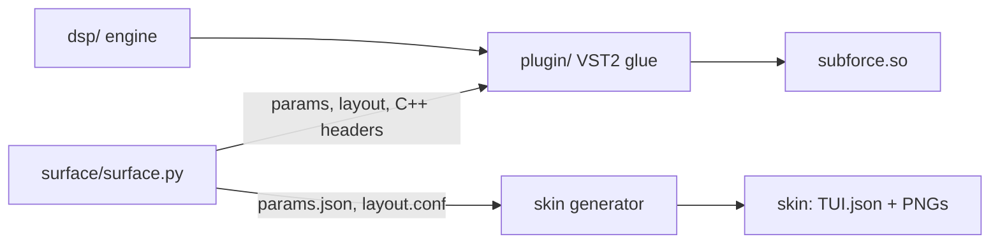
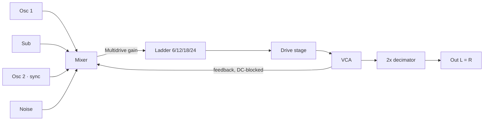

# Architecture

- [Overview](#overview)
- [Source layout](#source-layout)
- [Signal path](#signal-path)
- [Threads and real-time rules](#threads-and-real-time-rules)
- [Talking to MPC](#talking-to-mpc)
- [Parameters and saved state](#parameters-and-saved-state)

---

## Overview

SubForce is a single shared object, `subforce.so`, that MPC loads through its VST2 host, plus a
touchscreen skin generated at build time. The plugin side (VST2 glue, the touchscreen logic, the
preset library, the build, test and bench tooling) is PolyForce's, trimmed to presets only; the
engine is SubForce's own.

- **`surface/surface.py`** is the single source of the parameter list and the touchscreen pages.
  It writes `params.json`, `layout.conf`, `vst.json`, `build/param_ids.h` (ids, value curves,
  limits) and `build/factory_presets.h` (the factory presets, embedded), after checking the layout
  and every preset (keys, ranges, names).
- **`dsp/`** is the engine: no VST, no files, no threads. It renders a `Patch` for the keys it is
  given.
- **`plugin/`** is everything between the engine and MPC: VST2 entry points, MIDI, parameters,
  the touchscreen logic, the preset library and saved state.

## Source layout

| Path | Contents |
|---|---|
| `dsp/synth.*` | The engine: keys (priority, trigger, Duo, pedal), glide, the mod busses, drift, the control step, the 2x render loop, idling |
| `dsp/osc.h` | The morphing oscillator, hard sync and the sub, band-limited with polyBLEP / polyBLAMP |
| `dsp/ladder.h` | The nonlinear transistor ladder (zero-delay feedback, four taps) |
| `dsp/halfband.h` | The 2x decimator (polyphase IIR halfband); `tools/halfband_design.py` designs it |
| `dsp/env.h` | The DAHDSR envelope |
| `dsp/mod.h` | The busses' sources, destinations, controls and synced rates |
| `dsp/fastmath.h` | exp2, tan, tanh(x)/x, softclip, random numbers |
| `dsp/stages.h` | Stage timers for the profiling build (`-DSF_STAGE_TIMING`) |
| `plugin/plugin.cpp` | VST2 glue: MIDI with sample offsets, transport, chunk state, denormal flush, CPU meter |
| `plugin/surface.*` | The touchscreen side: parameter values, stepping, the preset browser, pushes to MPC |
| `plugin/patch_map.*` | 0..1 ↔ real values, display text, parameters → `Patch` |
| `plugin/library.*` | The preset library: scan, categories, favorites, recent |
| `plugin/presets.*` | Factory and user presets |
| `plugin/state.*` | The state text shared by projects and preset files |
| `plugin/paths.*` | Plugin folder, preset roots, data folder, atomic file writes |
| `plugin/vst2.h` | A hand-written slice of the VST2 ABI (no Steinberg SDK) |
| `presets/Factory/` | Factory presets: `NN_Category/NN_Name.sfp`, a folder per browser category |
| `test/` | The test suite (see [Building](BUILDING.md#tests)); `host.h` is a fake MPC host |
| `tools/bench.cpp` | `sfbench`, the CPU bench: `dlopen()`s the `.so` like MPC and times every block |
| `tools/pgo_train.cpp` | The trainer for the profile-guided build (runs under `qemu-arm`) |
| `tools/demos.cpp` | Renders the presets to WAV, level-matches them (BS.1770 loudness) |
| `third_party/mpc-vst-plugins/` | Vendored skin generator and installer (MIT), with marked local patches |

## Signal path

Everything from the oscillators to the VCA runs at **88.2 kHz** (2x), in one loop per sample:

1. **Every 8 samples (control step)**: glide, both mod busses, drift; the targets of every control
   value (the oscillators' phase increments and waves, the cutoff, resonance, drive, mixer levels,
   VCA gain). Each glides linearly to its target over the next 8 samples, so nothing steps.
2. **Every sample (44.1 kHz)**: both envelopes, the cutoff they move (`exp2` and `tan` per sample,
   so a 1 ms filter EG snaps), the oscillator shapes.
3. **Twice per sample (88.2 kHz)**: oscillators, sub and noise, the mixer with the feedback, the
   ladder, the drive stage, the VCA. Cutoff and VCA move halfway on the first half-step.
4. The halfband decimator folds the two samples into one; a 5 Hz DC blocker; the volume.

The oscillators run one high-rate sample late (11 µs): a discontinuity between two samples
corrects both, so hard sync and the keyboard reset are exact to the sub-sample.

When the amp EG has finished and the output has died away, the engine stops rendering (the
oscillators keep their free-running phase, the filter EG its release); a new note wakes it.

## Threads and real-time rules

| Thread | Runs |
|---|---|
| **Audio** (one of MPC's audio workers; which one changes between calls, instances run concurrently) | `processReplacing`: MIDI, the engine, the CPU meter, every call back into MPC |
| **UI** (MPC's UI side) | Parameters, display text, saved state (chunks), the browser, preset loads |

- Nothing on the audio thread allocates, locks or throws.
- Host callbacks happen only from `processReplacing`; never from `setParameter` or the dispatcher.
- A `try`/`catch` stands between every entry point and MPC: an exception never reaches the host.
- The patch reaches the audio thread as a snapshot of every parameter (a seqlock: a preset half
  written is never played); the engine gets a new `Patch` only when a value changed.
- Denormals are flushed to zero while a block renders.

## Talking to MPC

PolyForce's rules, device-proven in RackForce before it:

- MPC only notices value changes the plugin makes (lit browser tiles, the stepper, snapped steps)
  when they are pushed with `audioMasterAutomate`, and only re-reads texts after
  `audioMasterUpdateDisplay`. The plugin pushes from `processReplacing` only: at most 48 values per
  block (round-robin), a display update for changed texts at most every 4 blocks, plus the CPU
  meter's at most twice a second.
- A value MPC sends is recorded as what MPC shows only after the plugin has acted on it, so a
  preset load in between never has the old value pushed back.
- Steppers move exactly one item per event, whatever delta MPC sends; MPC echoing the plugin's own
  value back is ignored. A tile's release echo (~0.7 s after a tap) is ignored.

## Parameters and saved state

- **Parameters** are free to change until v0.1, then **append-only**: MPC projects store values by
  index. Sound parameters (kind `synth`) are saved and automatable; the surface's own values (the
  stepper, tiles, Rand Amount) are not.
- **Saved state** (projects and `.sfp` preset files) is the text format `subforce 1`: `key=value`
  lines of *real* values (Hz, seconds, semitones…) plus, in a project, the preset key. Ranges can
  change without remapping saved projects.
- **Lists**: the option lists in `surface.py` must match the engine's enums; `static_assert`s in
  `plugin/patch_map.cpp` check the counts and that the amp EG and mod bus 2 mirror the filter EG and
  bus 1 key for key.
