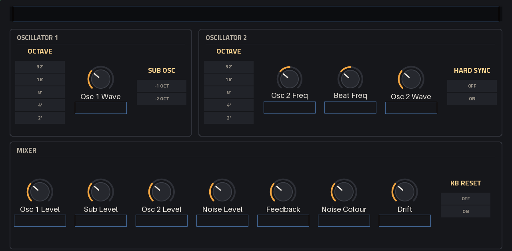
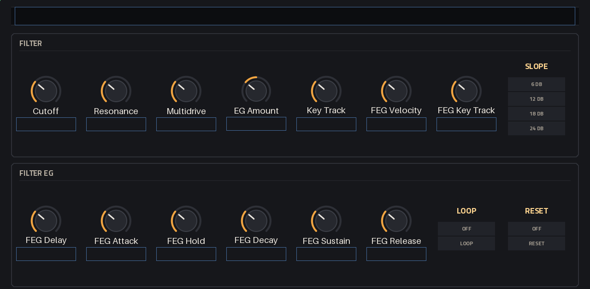
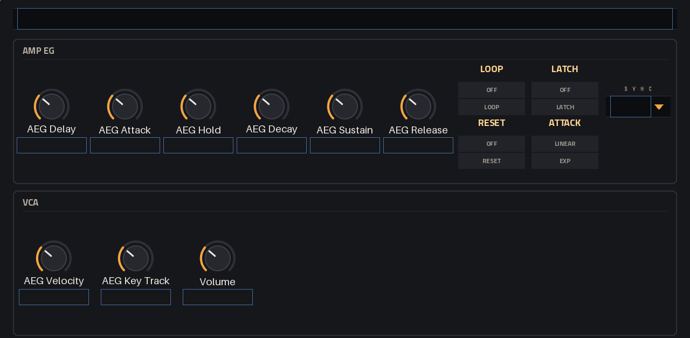
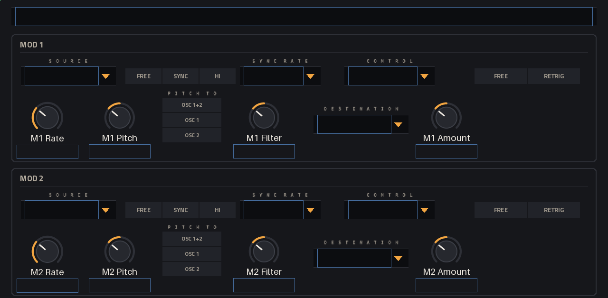
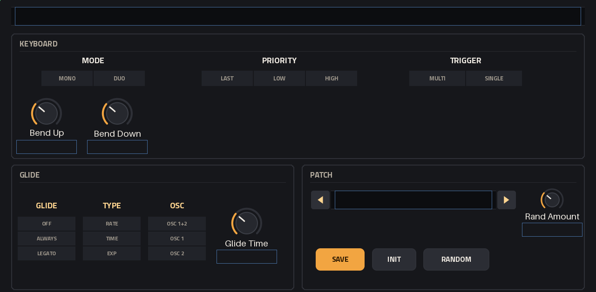

# User guide

- [The idea](#the-idea)
- [The screen](#the-screen)
- [The sound engine](#the-sound-engine)
- [Keys, glide and Duo](#keys-glide-and-duo)
- [The mod busses](#the-mod-busses)
- [Presets](#presets)
- [Melodic techno](#melodic-techno)
- [MIDI](#midi)

---

## The idea

One voice, played like a classic 37-key American paraphonic analog monosynth (*the original* in
these docs): two oscillators and a sub into a mixer, a 4-pole transistor ladder, two envelopes and
two mod busses, with the panel's habits kept — push the mixer and the filter overdrives, turn the
resonance up and the bass thins out, take it past 70% and the filter sings on its own. Where the
original's manual says how its panel behaves, SubForce does the same: the feedback loop, the
resonance knob, Multidrive's character, the envelopes' attack and loop, the pink noise.

## The screen

Six tabs. Every tab has the status line at the top: `VOICES 1   CPU 3%   PEAK 4%`. CPU is the
plugin's share of one core over the last half second (100% would be rendering taking as long as the
audio lasts), PEAK its slowest block in that time; VOICES is 0, 1 or 2 (Duo on two keys).

| Tab | What's on it |
|---|---|
| **OSC** | Oscillator 1 (octave, wave, sub octave), oscillator 2 (octave, frequency, wave, hard sync), the mixer (osc 1, sub, osc 2, noise, feedback, noise colour, drift, keyboard reset) |
| **FILTER** | Cutoff, resonance, Multidrive, filter EG amount, key track, the filter EG's velocity and key tracking, slope; the filter EG |
| **AMP** | The amp EG; velocity, key tracking and volume |
| **MOD** | Mod 1 and mod 2: source, sync, sync rate, control, trigger; rate, pitch amount and where it goes, filter amount, the third destination and its amount |
| **BROWSE** | Preset categories and presets; favorite, a random preset, save, init |
| **KEYS** | Mono / Duo, note priority, trigger; bend ranges; glide; the preset stepper, save, init, randomize |

The pages, rendered offline from the skin (on the device MPC fills in the values and lights the
chosen options):

| | |
|---|---|
|  |  |
|  |  |
|  | |

Every tab has a Q-Link set named after what it controls (`OSC + MIX`, `FILTER`, `AMP`, `MOD 1+2`,
`BROWSE`, `KEYS`). Stepped controls (octaves, slopes, modes, the preset stepper) move exactly one
step per Q-Link detent or data-wheel click.

## The sound engine

### Oscillators

- **Octave**: 32', 16', 8', 4', 2' (8' plays the key's pitch).
- **Wave**: a continuous sweep from triangle (0) through saw, square, down to a 6% pulse. In between
  the shapes cross-fade; past square the pulse narrows. The value shows the shape: `Saw`,
  `Saw-Sqr 40%`, `Pulse 23%`.
- **Osc 2 Freq**: ±7 semitones against oscillator 1, for beating, intervals, or sync sweeps.
- **Hard Sync**: oscillator 2 restarts its cycle with oscillator 1's; move osc 2's frequency (by
  hand, or with a bus) for the tearing sync sound. Osc 1 can be silent in the mixer and still lead.
- **Sub Octave**: the sub oscillator is a square one or two octaves under oscillator 1.
- **KB Reset**: On, every note that starts the envelopes starts the oscillators at the beginning of
  their cycle too (the same punch every time); Off, they run free, as analog oscillators do.
- **Drift**: slow random pitch movement of each oscillator (up to ±6 cents) and of the cutoff,
  plus a small offset per note. 0 is perfectly stable.

All oscillators are band-limited (polyBLEP) and run at twice the sample rate.

### Mixer

Osc 1, Sub, Osc 2, Noise and **Feedback** levels. The knobs have an audio taper. Several sources
up high drive the filter harder — on purpose. **Feedback** takes the mixer's own output back into
the mixer, as the original's FEEDBACK knob does with nothing in EXT IN: up to about 85% it thickens
and pushes the filter harder, past that the loop runs over unity and gets gritty, and the last
tenth is the chaos of an overdriven loop (about +6 dB louder at full: turn the volume down). With
resonance it howls. **Noise Colour** goes from white (0) through pink (the middle, the original's
noise, the default) to dark (1), at the same loudness.

### Filter

A 4-pole transistor ladder, modelled with its nonlinearities.

- **Cutoff** 20 Hz–20 kHz. **Resonance**: past 70% the filter oscillates by itself, a sine at the
  cutoff, as on the original, where "settings above 7" self-oscillate. Play it with Key Track at
  100%: it tracks the keyboard, a little flat at the top of the resonance, like the circuit.
  Resonance also thins the bass, as on the original: about 13 dB just under the edge.
- **Multidrive**: drives the ladder and a second stage after it, as the original's OTA and FET stages
  between the filter and the VCA: asymmetric, tube-like warmth (even harmonics) in the middle of
  its range, toward hard clipping at full. Louder too, but by a few dB, not a jump.
- **Slope**: 6, 12, 18 or 24 dB per octave (the outputs of the ladder's four stages).
- **EG Amount**: the filter EG's sweep, up to ±10 octaves (the value shows octaves).
- **Key Track**: 0–200%; 100% makes the cutoff follow the keyboard exactly (around middle C).
- **FEG Velocity**: how much velocity scales the filter EG (and so the sweep).
- **FEG Key Track**: higher notes, shorter filter EG times.

### Envelopes

Both are **DAHDSR**: Delay, Attack, Hold, Decay, Sustain, Release (every stage up to 10 s; attack,
decay and release from 1 ms, delay and hold from 0). As on the original, the attack is linear (its
default curve); decay and release fall exponentially (the times are to −60 dB).

- **Loop**: while the key is held the envelope cycles delay → attack → hold → decay → release and
  round again, the release stage included, as on the original. With Sustain at 0 that is a plain
  D-A-H-D cycle; with Sustain up, decay falls to it and release takes it the rest of the way.
- **Reset**: a new note's attack starts from 0. Off, it starts from wherever the envelope is (smooth
  legato, the analog way).
- **Velocity** and **Key Track** as above; the amp EG's are on the AMP tab.

## Keys, glide and Duo

- **Mode**: *Mono*, or *Duo*: oscillator 1 plays one key and oscillator 2 another, through the one
  filter and VCA (paraphonic). With one key down, both play it.
- **Priority**: which key sounds when several are down — *Last*, *Low* or *High*. Releasing a key
  returns to the next one by the same rule. In Duo, oscillator 1 takes the first by priority,
  oscillator 2 the second.
- **Trigger**: *Multi* restarts the envelopes on every key struck, a sounding key struck again too
  (held by the pedal, or repeated); releasing a key hands the oscillators back to one still held
  without a new attack. *Single* only when the gate was closed (legato phrases play on one
  envelope).
- **Glide**: *Off*, *Always*, or *Legato* (only between overlapping keys). **Type**: *Rate* (the
  time per octave: big leaps take longer), *Time* (every glide takes the same time), *Exp*
  (exponential, fast then slow, like an RC). **Osc**: which oscillators glide.
- **Bend Up / Down**: the pitch bend range, 0–24 semitones each way.
- The sustain pedal keeps the last note sounding until it lifts. While it holds the gate open, the
  next key plays legato, as on the original: Single doesn't restart the envelopes and Legato glide
  glides.

## The mod busses

Two identical busses. Each takes one **source** and sends it to three places at once:

| | |
|---|---|
| **Source** | Triangle, Square, Saw (falling), Ramp (rising), S&H (a new random value each cycle), Smooth (gliding random), Filter EG |
| **Rate** / **Sync** / **Sync Rate** | 0.05–100 Hz free, or a note value of MPC's tempo (8 bars to 1/32T) |
| **Trigger** | *Free*: runs on its own (a synced bus locks to the bar while MPC plays, unless the other bus is modulating its rate); *Retrig*: restarts at every new note |
| **Pitch** + **Pitch To** | pitch amount (up to ±24 st, fine near 0) for osc 1+2, osc 1 or osc 2 |
| **Filter** | cutoff amount (up to ±5 octaves) |
| **Destination** + **Amount** | one more target: Wave 1+2, Wave 1, Wave 2, Resonance, Multidrive, Sub, Noise, Feedback, Volume, or Other Rate (the other bus's rate, ×1/16..×16) |
| **Control** | what sets the depth: *Always*, the *Mod Wheel*, *Aftertouch* (channel pressure) or *Velocity* |

Mod 1 starts on the mod wheel, so its pitch amount gives vibrato under the wheel; mod 2 starts on
Always.

Recipes: **sync sweep** — source Filter EG, pitch to Osc 2, Hard Sync on. **Laser** — Filter EG to
pitch at a large amount. **Wobble** — a synced triangle on the filter, Retrig. **PWM** — a slow
triangle to Wave 1 with the wave near square.

## Presets

57 factory presets in seven categories (Templates, Bass, Lead, Keys, FX, Sequence, Pad), all
level-matched (−16 LUFS on their demo phrase, peaks under −1 dBFS). Pick them on the BROWSE tab or
step through them on KEYS.

- **SAVE** writes `User NNN.sfp` to `Presets/User/` in the plugin folder (`/sdcard/Synths/Devko -
  VST - SubForce/`). There is no text entry on the device, so presets are numbered; a number is
  never used twice. Rename them on a computer; the
  name shows in the browser. Files added, renamed or deleted while MPC runs show up when you browse
  (or in a new instance).
- **INIT** loads Init: one saw through a half-open filter.
- **RANDOM** moves the sound toward a random one by **Rand Amount**: oscillators, mixer, filter and
  the envelopes' main stages. Volume, the keyboard, glide and the busses stay. Rand Amount itself is
  a setting of the page, not part of a sound: presets don't save or change it.
- **BROWSE**: the first two categories are FAVORITES and RECENT. The heart toggle marks the loaded
  preset as a favorite. **RND** loads a random preset of the category shown (never the one loaded);
  it isn't RANDOM, which changes the sound.
- Presets on the Force's internal drive: `/media/AkaiForce/SubForce Presets/` (any folders inside
  become categories, loose files go to "Unsorted"; a folder named like a factory category shows as
  "<Name> (files)").
- A preset file is plain text (`subforce 1` and `key=value` lines of real values), the same as an MPC
  project stores.

## Melodic techno

The original is all over melodic techno, Stephan Bodzin's above all: two of them in his studio,
its successor on stage, "the backbone of his music and his live set" (DJ Mag) — basslines
sequenced from the computer, leads played by hand, and constant rides of cutoff, resonance, drive
and glide. These presets are built on what is documented about that way of playing (no artist's
patch is copied, the names are SubForce's own, and no artist endorses SubForce):

| Preset | What it is | Play it |
|---|---|---|
| **Bass / Rolling Sixteen** | Saw and sub, a 160 ms filter snap, KB Reset: the driving 16th bassline | 16ths from the sequencer, A1–D2; open FEG Decay through the build |
| **Bass / Horizon Drift** | Two detuned saws, the sub, feedback and resonance holding a growl under a low cutoff | Long legato roots, Bb0–F2; ride Cutoff and Resonance (FILTER Q-Links 1 and 2) |
| **Bass / Fifth Engine** | Saw plus a saw a fifth up, sub, feedback: the one-finger power chord | Legato, Bb0–C2; ride Osc 2 Freq between +7 and 0 |
| **Bass / Glide Smear** | Constant-rate glide (big leaps slide longer) on a singing bass | Overlap keys to slide; ride Glide Time in the phrase |
| **Bass / Grit Roller** | Multidrive and feedback; velocity drives it harder | Play the velocity: soft is round, hard is torn |
| **Sequence / Resonant Steps** | Resonance just under the edge, a bar-locked filter sweep | The Force's arpeggiator or sequencer at 1/16, C2–C4 |
| **Sequence / Ladder Acid** | An acid line through the round 24 dB ladder, legato slides | 16ths, overlap for slides, accents for the squelch |
| **Lead / Afterglow Lead** | Two detuned saws, a little feedback, exp legato glide, wheel vibrato | C4–C6, legato, into a long reverb |
| **Lead / Resonant Cry** | Resonance at the edge, feedback and drive; aftertouch opens it | Lean into the keys (pressure), wheel for vibrato |
| **Lead / Swell Lead** | Opens over a second as it is held; single trigger | Slow phrases, long notes |
| **Pad / Slow Bloom Duo** | Duo: two keys, two oscillators, a slow bloom | Hold two-note intervals |
| **Pad / Tidal Loop** | A looping filter EG breathing every ~4 s | Hold one note |
| **FX / Riser Engine** | A 4-bar synced rise of pitch, cutoff and feedback | Start it 4 bars before the drop |

The other presets of this set are classic patches of the original: Foundation Bass, Sub Pressure,
Offbeat Knock, Knuckle Pluck, Glass Arpeggio, Sync Arpeggio, Duo Intervals, Solo Brass, Breath
Flute, Tearing Sync, Fuzz Square, Hollow Haze, Downlifter, Impact Boom, Feedback Howl, Data Burble,
Loop Ticker.

Tips: 121–125 BPM; basslines live between about A0 and F2; ride Cutoff, Resonance, Multidrive and
EG Amount on the FILTER Q-Link set (Q-Links 1–4); use MPC's delay and reverb on the track (SubForce
has no effects of its own, on purpose).

## MIDI

| Message | Does |
|---|---|
| Note on / off | play (velocity per the EG velocity settings) |
| Pitch bend | ± the bend ranges |
| CC 1 (mod wheel) | a bus's depth, if its control is Mod Wheel |
| Channel pressure | a bus's depth, if its control is Aftertouch |
| Poly aftertouch | the same, from the sounding key's own pressure (what MPC's pads send) |
| CC 64 | sustain pedal (re-striking a held key retriggers in Multi) |
| Note on for a key already down | restrikes it (Multi retriggers); one note-off then releases it: a key is either down or up, as on a keyboard |
| CC 120 / 121 / 123 | all sound off / reset all controllers (bend, wheel, pressure, pedal) / all notes off |

SubForce listens on every MIDI channel.
